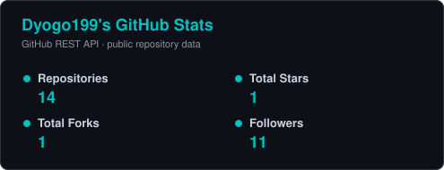
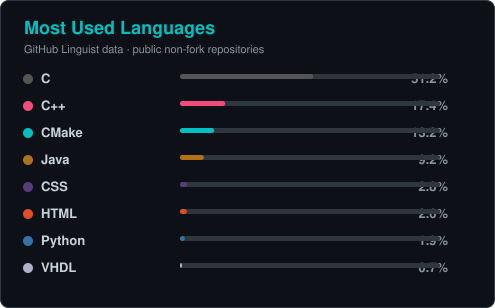

<h1 align="center">Dyogo Mondego</h1>

<h3 align="center">
MSc Student in Computer Science @ IME-USP · Researcher in Empirical Software Engineering & AI · Software Engineer
</h3>

Artificial Intelligence · Empirical Software Engineering · Backend Development · Cybersecurity · Embedded Systems · IoT

  
  
  

---

## About Me

I am a **Master's student in Computer Science at IME-USP** working at the intersection of **Empirical Software Engineering and Artificial Intelligence**. My research investigates the **maintainability and technical sustainability of AI-generated code**, with emphasis on software quality, complexity, technical debt, and reproducible empirical evaluation.

Beyond research, I design and build software and experimental systems across **backend engineering, cybersecurity, embedded systems, IoT, infrastructure, automation, and applied AI**, combining a multidisciplinary background in computing, data, and engineering.

---

## Research Interests

<table>
<tr>
<td width="50%" valign="top">

### Empirical Software Engineering & AI

- AI-generated and AI-assisted software
- Software maintainability and technical debt
- Software quality and complexity metrics
- Large Language Models for software engineering
- Reproducible empirical software studies
- RAG and agentic AI systems

</td>

<td width="50%" valign="top">

### Intelligent & Secure Systems

- Backend and distributed systems
- Cybersecurity and secure software engineering
- Embedded systems and Internet of Things
- Edge AI and TinyML
- Energy-aware and resilient computing
- Smart-city computing systems

</td>
</tr>
</table>

---

## Current Research

### Maintainability and Sustainability of AI-Generated Code

As AI-assisted development becomes increasingly integrated into software engineering workflows, an important open question is whether code generated or modified by Large Language Models remains **maintainable, understandable, and technically sustainable over time**.

My master's research addresses this problem through a **mixed-method empirical software engineering study**, combining quantitative analysis of real-world software repositories and benchmark tasks with qualitative evidence about software evolution and maintainability.

The quantitative evaluation focuses on indicators such as **Maintainability Index, Cyclomatic Complexity, software quality measures, and technical debt**, while the broader analysis investigates how AI-generated changes affect the long-term evolution of software systems.

**Research goals:**

- provide empirical evidence about the maintainability of AI-generated software;
- identify recurring maintainability and technical-debt patterns;
- develop a practical and reproducible evaluation framework;
- support researchers and developers in assessing the long-term quality of AI-assisted code.

**Key topics:** `Maintainability Index` · `Cyclomatic Complexity` · `Technical Debt` · `LLMs` · `SWE-bench` · `Software Quality` · `Empirical Software Engineering` · `Reproducibility`

---

## Selected Engineering & Research Projects

### [Veterinary Pulse Oximeter](https://github.com/Dyogo199/ProjetoFinalEmabarcatech)

Embedded monitoring prototype for real-time **SpO₂ and heart-rate acquisition**, integrating a **MAX30105 optical sensor**, **Raspberry Pi Pico W**, and **OLED display**.

`Embedded Systems` · `Raspberry Pi Pico W` · `MAX30105` · `Signal Acquisition`

---

### [Crudify — Spring Boot User Management API](https://github.com/Dyogo199/CrudifyGerenciadordeUsuariosEmSpring-Boot)

RESTful user-management application implementing a complete CRUD architecture with **Java, Spring Boot, Spring Data JPA, H2, Maven, and layered MVC organization**.

`Java` · `Spring Boot` · `REST API` · `JPA` · `H2` · `Maven`

---

### [Multithreaded HTTP Server in C++](https://github.com/Dyogo199/ServidorHTTP)

HTTP server implemented in **C++** with support for **GET and POST requests, concurrent connections, static-file serving, access logging, and basic path-traversal protection**.

`C++` · `HTTP` · `Sockets` · `Multithreading` · `Networking`

---

### [In-Memory Database in C](https://github.com/Dyogo199/BancoDeDadosMemoria)

Educational database implementation exploring **in-memory record management, CRUD operations, B+ tree indexing, data structures, and systems programming in C**.

`C` · `B+ Tree` · `Data Structures` · `CRUD` · `Systems Programming`

---

### [Sorting Algorithms Benchmark — Python](https://github.com/Dyogo199/Artigo_Ordena-o_Python)

Experimental benchmark comparing **Bucket Sort, Merge Sort, and Bubble Sort** across multiple input sizes and repeated executions, including descriptive execution-time statistics.

`Python` · `Algorithms` · `Benchmarking` · `Performance Analysis`

---

## Technology Stack

### Core Engineering

**Languages:** `Java` · `Kotlin` · `Python` · `C` · `C++`

**Backend & Software Engineering:** `Spring Boot` · `Ktor` · `REST APIs` · `JPA` · `Maven` · `Gradle` · `Software Architecture` · `Testing`

### Systems, Data & Infrastructure

**Databases & Data:** `PostgreSQL` · `MySQL` · `MongoDB` · `H2` · `SQL` · `Data Analysis`

**DevOps & Infrastructure:** `Docker` · `Linux` · `Git` · `GitHub Actions` · `CI/CD` · `Cloud Infrastructure`

**Embedded & IoT:** `ESP32` · `ESP8266` · `Raspberry Pi Pico W` · `FreeRTOS` · `Arduino` · `Orange Pi` · `Sensors` · `MQTT` · `Edge Computing`

### AI & Security

**AI & Applied Research:** `Machine Learning` · `Large Language Models` · `RAG` · `Agentic AI` · `TinyML` · `Empirical Data Analysis`

**Cybersecurity:** `Application Security` · `Network Security` · `Linux Security` · `Penetration Testing` · `Threat Analysis` · `Secure Software Development`

### Additional Technologies

`Rust` · `JavaScript` · `TypeScript` · `React` · `Node.js` · `AWS` · `Azure`

---

## Academic Background

🎓 **MSc in Computer Science — University of São Paulo (USP)**  
Institute of Mathematics and Statistics — IME-USP  
Research area: Artificial Intelligence & Empirical Software Engineering

🎓 **Chemical Engineering**

🎓 **Information Technology**

🎓 **Data Science**

My multidisciplinary background allows me to work across the boundaries of **software, hardware, data, AI, engineering, and cybersecurity**.

---

## GitHub Analytics

---

## Development Activity

---

## Open to Collaboration

I am interested in collaborating on research and engineering projects involving:

**Artificial Intelligence · Software Engineering · LLMs · Cybersecurity · Backend Systems · Embedded Systems · IoT · Edge Computing · Smart Cities**

For academic collaboration, software engineering projects, research partnerships, or technical discussions:

  
  

<i>Building reliable software, researching intelligent systems, and connecting software engineering with real-world computing.</i>

